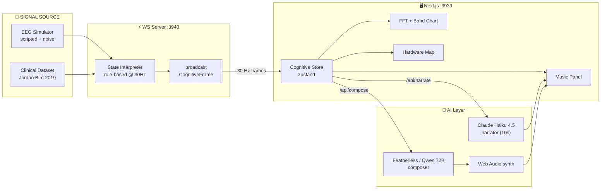
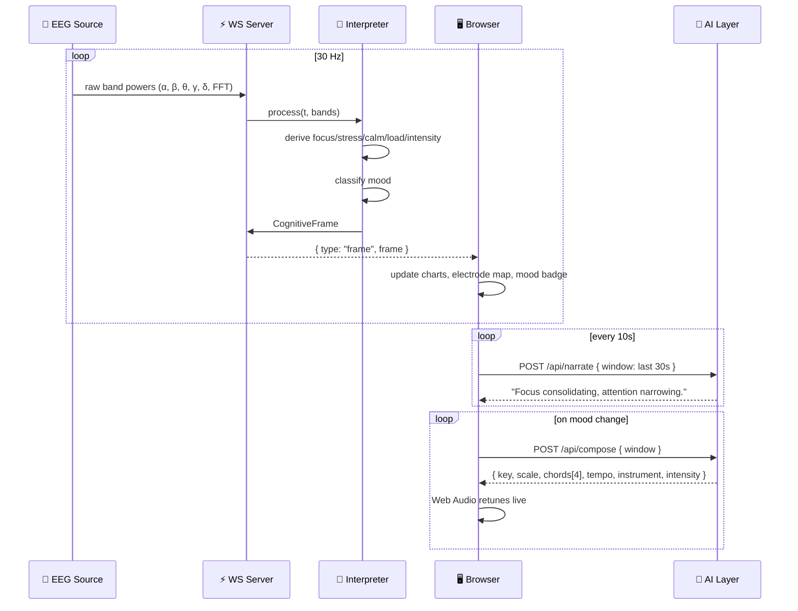

<div align="center">

# 🧠 Wavy

### A Neuroadaptive Brain–Computer Interface
*Real-time cognitive-state-aware computing — your screen feels what your brain feels.*

[](https://nextjs.org/)
[](https://www.typescriptlang.org/)
[](https://react.dev/)
[](https://tailwindcss.com/)
[](https://developer.mozilla.org/en-US/docs/Web/API/WebSockets_API)
[](https://www.anthropic.com/)
[](#license)

</div>

---

## 📖 Table of Contents

1. [The Problem](#-the-problem)
2. [The Solution](#-the-solution)
3. [Live Demo](#-live-demo)
4. [Key Features](#-key-features)
5. [How It Works](#-how-it-works)
6. [System Architecture](#-system-architecture)
7. [The Cognitive Pipeline](#-the-cognitive-pipeline)
8. [Dataset & Clinical Validation](#-dataset--clinical-validation)
9. [Tech Stack](#-tech-stack)
10. [Getting Started](#-getting-started)
11. [Project Structure](#-project-structure)
12. [Demo Script](#-demo-script-60-seconds)
13. [Roadmap](#-roadmap)
14. [Team](#-team)

---

## 🎯 The Problem

> **Software is blind to the human using it.**

Every interface today — from your IDE to your meditation app — is *reactive*: it responds only to clicks, taps, and keystrokes. It has **zero awareness** of the cognitive state of the person sitting in front of it.

This creates real, measurable harm:

| Domain | The Cost of Cognitive-Blind Software |
|---|---|
| 🏥 **Mental Health** | Clinicians have no objective, real-time signal of patient distress between appointments. |
| 💼 **Workplace Burnout** | Knowledge workers have no early-warning system for cognitive overload. |
| ♿ **Accessibility** | Users with ADHD, anxiety, or sensory sensitivities get one-size-fits-all UIs. |
| 🎓 **Learning** | EdTech platforms cannot tell when a student is focused vs. drifting vs. overwhelmed. |
| 🚗 **Safety-Critical Work** | Pilots, surgeons, and drivers have no real-time fatigue/load monitoring. |

**The gap:** EEG hardware is now consumer-grade (Muse, Emotiv, OpenBCI), and ML can decode mental state from brainwaves — but no one has built a clean, real-time pipeline that turns those signals into **adaptive software**.

---

## 💡 The Solution

**Wavy** is a real-time platform that reads brainwave-derived cognitive metrics, infers the user's mental state, and adapts the interface — visuals, audio, and AI narration — in a closed feedback loop.

```
brain  →  signal  →  state  →  adaptation  →  brain
   ↑___________________________________________↓
                  neurofeedback loop
```

It is a **demonstrable, working prototype** of what cognitive-state-aware computing looks like. Music and visuals are the *demo layer*; the real product is the **state-inference engine** underneath, which any application can plug into.

> **Wavy is not a music app, a visualizer, or a meditation tool. It is the missing layer between the brain and the operating system.**

---

## 🎬 Live Demo

When you launch Wavy, you can switch between two data sources in real time:

| Mode | Source | Purpose |
|---|---|---|
| 🟣 **Live Simulation** | Scripted EEG generator with organic noise | Predictable demo loop (~77s scene cycle) |
| 🧬 **Clinical Dataset** | Real EEG recordings (Jordan Bird, 2019) | Authentic positive / negative / neutral states |

Each mode drives the **entire pipeline live** — FFT spectrum, band-power chart, mood inference, AI music composition, and natural-language narration all update at 30Hz.

---

## ✨ Key Features

### 🧠 Real-Time Cognitive State Inference
- **30Hz processing pipeline** — sub-frame latency from signal to state
- **5-dimensional cognitive vector**: focus, stress, calmness, cognitive load, emotional intensity
- **Rule-based mood classification**: `calm` · `focused` · `engaged` · `overloaded` · `drifting`
- **Live BPM estimation** derived from stress/calmness deltas

### 📊 Clinical-Grade Signal Visualization
- Live **FFT power spectrum** (0–64 Hz)
- **Band-power decomposition** — δ (delta), θ (theta), α (alpha), β (beta), γ (gamma)
- **14-channel electrode placement map** (10-20 system, Emotiv EPOC X)
- **Per-channel impedance / contact-quality monitoring**

### 🎵 Adaptive AI Music Composition
- **Featherless AI** (Qwen 2.5 72B) composes a 4-chord progression matched to your mental state
- Ambient music engine built on the **Web Audio API** — chords, instrument, tempo, intensity all driven by cognitive metrics
- Live audio spectrum visualization reading directly from `AnalyserNode`
- Deterministic fallback presets per mood — demo never breaks

### 🗣️ AI Cognitive Narrator
- **Claude Haiku 4.5** observes the last ~30s of cognitive metrics and produces a one-sentence clinical readout
- Prompt-cached system block for low-latency, low-cost inference
- Polls every 10s, crossfades into the UI via Framer Motion
- Deterministic fallback table per mood when API key is absent

### 🧬 Real Clinical Dataset Playback
- Streams the **Jordan Bird Emotion EEG dataset** (2019) — 51MB of real human recordings
- Filterable by emotion label: `POSITIVE` / `NEGATIVE` / `NEUTRAL`
- Smooth interpolation between rows for natural playback

### 💾 Session Recording
- Prisma + SQLite session log: duration, data source, average focus / stress / calmness
- One-click "Start Session" / "Stop Recording" persists to disk

---

## 🔬 How It Works

The pipeline runs in **four continuous stages**, each at 30 frames per second:

### 1️⃣ Signal Acquisition
A WebSocket server emits raw band powers from one of two sources:
- **Simulator**: scripted scene loop (calm → focus → deep_focus → overload → recovery) layered with organic noise, breathing sines, and stochastic spikes
- **Dataset**: streams pre-recorded EEG samples at 30Hz with row-to-row interpolation

### 2️⃣ State Interpretation
A deterministic rule-based interpreter maps band powers to a 5D cognitive vector:

```
FOCUS      = β · 1.0  + θ · -0.5 + 0.20
CALMNESS   = α · 1.0  + β · -0.5 + 0.30
STRESS     = β · 1.0  + intensity · 0.30 + α · -0.50
LOAD       = EMA(β + 0.6·θ)   smoothing α=0.04
INTENSITY  = EMA(|Δα|+|Δβ|+|Δθ| × 8)   smoothing α=0.05
BPM        = 70 + stress·30 - calm·15   smoothing α=0.03
```

Mood is then resolved through a priority cascade:

```
if phase==overload  OR (stress>0.65 AND load>0.6)  →  overloaded
elif focus > 0.68                                  →  focused
elif calm > 0.65 AND focus < 0.5                   →  calm
elif calm < 0.35 AND focus < 0.45                  →  drifting
else                                               →  engaged
```

### 3️⃣ Adaptive Output
The cognitive state drives **three independent adaptation channels** in parallel:

- **🎨 Visuals** — FFT chart, band-power chart, electrode map, mood indicator all update live
- **🎵 Music** — Featherless AI composes new chord progressions and the Web Audio synth retunes in real-time
- **🗣️ Narration** — Claude Haiku writes one-sentence clinical observations every 10s

### 4️⃣ Closed Loop
The user sees, hears, and reads their own mental state. This is **neurofeedback** — the act of perceiving your state changes your state, completing the loop.

---

## 🏗️ System Architecture



> The **WS server owns the simulation clock** — there is one global simulator shared across all clients.
> The **LLM never blocks the realtime loop** — it runs on demand at low frequency (every 10s for narration, only when cognitive state shifts for music).

---

## 🔁 The Cognitive Pipeline



---

## 🧬 Dataset & Clinical Validation

Wavy ships with the **Jordan J. Bird Emotion EEG Dataset (2019)** — 51 MB of real EEG recordings from the **Emotiv EPOC X** (14-channel, 256 Hz, 14-bit). Subjects were recorded while viewing stimuli labeled `POSITIVE`, `NEGATIVE`, or `NEUTRAL`.

| Property | Value |
|---|---|
| Source | Jordan Bird et al. (Nottingham Trent), 2019 |
| Subjects | 2 (1 male, 1 female) |
| Channels | 14 (10-20 EEG montage) + 2 reference |
| Sample Rate | 256 Hz (downsampled to 128 Hz in CSV) |
| Features per row | 5 band-power means + 64 FFT bins per channel |
| Labels | POSITIVE, NEGATIVE, NEUTRAL |
| File | `data/emotions.csv` (51 MB) |

This grounds the demo in **real human neural data** — not just simulation.

---

## 🛠️ Tech Stack

<table>
<tr>
<th align="left">Layer</th>
<th align="left">Technology</th>
<th align="left">Why</th>
</tr>
<tr>
<td><b>Frontend</b></td>
<td>Next.js 14 · React 18 · TypeScript 5</td>
<td>App Router monolith — single <code>npm run dev</code> runs everything</td>
</tr>
<tr>
<td><b>Styling</b></td>
<td>Tailwind CSS 3</td>
<td>Stable, sprint-friendly, no v4 churn</td>
</tr>
<tr>
<td><b>State</b></td>
<td>Zustand 5</td>
<td>180-frame ring buffer + zero-rerender canvas reads via <code>getState()</code></td>
</tr>
<tr>
<td><b>Realtime</b></td>
<td><code>ws</code> 8 · WebSocket Server</td>
<td>30 Hz streaming, single global simulator, last-frame-on-connect</td>
</tr>
<tr>
<td><b>Audio</b></td>
<td>Web Audio API (handwritten synth)</td>
<td>Tempo-synced ambient pads + melody, real <code>AnalyserNode</code> spectrum</td>
</tr>
<tr>
<td><b>AI Narrator</b></td>
<td>Anthropic Claude Haiku 4.5</td>
<td>Low-latency, prompt-cached system block, deterministic fallback</td>
</tr>
<tr>
<td><b>AI Composer</b></td>
<td>Featherless AI (Qwen 2.5 72B Instruct)</td>
<td>Open-source LLM for structured JSON music params</td>
</tr>
<tr>
<td><b>Dataset</b></td>
<td><code>csv-parse</code> · streaming CSV</td>
<td>51 MB EEG dataset, normalized + interpolated on the fly</td>
</tr>
<tr>
<td><b>Persistence</b></td>
<td>Prisma 7 · SQLite</td>
<td>Lightweight session logs, zero-config local DB</td>
</tr>
<tr>
<td><b>Animation</b></td>
<td>Framer Motion 11</td>
<td>Narrator crossfade, mood transitions</td>
</tr>
<tr>
<td><b>Dev Loop</b></td>
<td><code>concurrently</code> · <code>tsx watch</code></td>
<td>Hot-reloads both web and WS server in one terminal</td>
</tr>
</table>

---

## 🚀 Getting Started

### Prerequisites
- Node.js ≥ 18
- npm ≥ 9
- *(Optional)* `ANTHROPIC_API_KEY` for live narrator
- *(Optional)* `FEATHERLESS_API_KEY` for live music composer

### Install & Run

```bash
git clone https://github.com/binur-torrent/DTC.git
cd DTC
npm install
npx prisma generate
npm run dev
```

Then open **http://localhost:3939**.

### Optional: enable live AI

Create `.env.local`:

```bash
ANTHROPIC_API_KEY=sk-ant-...
FEATHERLESS_API_KEY=fw_...
FEATHERLESS_MODEL=Qwen/Qwen2.5-72B-Instruct
```

Without these, Wavy falls back to deterministic per-mood narration and music presets — **the demo never breaks**.

### Ports

| Service | Port | Override |
|---|---|---|
| Web (Next.js) | `3939` | edit `package.json` script |
| WebSocket | `3940` | `WS_PORT` env var · client `NEXT_PUBLIC_WS_URL` |

---

## 📁 Project Structure

```
DTC/
├── app/
│   ├── page.tsx                  Dashboard composition + view router
│   ├── layout.tsx                Root metadata
│   └── api/
│       ├── narrate/route.ts      Claude Haiku narrator endpoint
│       ├── compose/route.ts      Featherless AI music composer endpoint
│       └── sessions/route.ts     Session log persistence
├── components/
│   ├── Header.tsx                Top bar — mood, source selector, session controls
│   ├── Sidebar.tsx               Left rail — view switcher (signals / music / hardware / subject)
│   ├── FFTChart.tsx              Live 0–64 Hz power spectrum
│   ├── BandPowerChart.tsx        δ θ α β γ band amplitudes over time
│   ├── HardwareStatus.tsx        14-channel electrode map + impedance
│   ├── CaseStudyPanel.tsx        Clinical dataset selector (POS / NEG / NEUTRAL)
│   ├── MusicPanel.tsx            AI composer UI — chord progression, tempo, instrument
│   ├── AudioSpectrum.tsx         Real-time AnalyserNode spectrum
│   ├── ParameterPanel.tsx        Display range controls (amax, fmax, etc.)
│   └── ...                       (Wave / Lissajous / Chladni visualizers)
├── lib/
│   ├── types.ts                  CognitiveFrame · MusicParams · WSMessage
│   ├── cognitiveStore.ts         Zustand store — 180-frame ring buffer
│   ├── musicStore.ts             Music state + active chord tracking
│   ├── audioEngine.ts            Web Audio synth (chords, melody, pads)
│   ├── useCognitiveStream.ts     WebSocket client + auto-reconnect
│   ├── useNarrator.ts            10s narrator polling hook
│   ├── useComposer.ts            Music composer trigger hook
│   └── db.ts                     Prisma client singleton
├── server/
│   ├── ws.ts                     WS entry — 30 Hz broadcast, mode switching
│   ├── eegSimulator.ts           Scripted scene + organic noise generator
│   ├── stateInterpreter.ts       Rule-based mood + cognitive metric engine
│   └── dataPlayback.ts           CSV streaming + normalization + interpolation
├── prisma/
│   └── schema.prisma             Session model
├── data/
│   └── emotions.csv              51 MB Jordan Bird EEG dataset
└── DOCS.md                       Engineering handoff doc
```

---

## 🎤 Demo Script (60 seconds)

> Use this to walk a presenter through the demo without missing a beat.

**0:00** — Open `http://localhost:3939`. Click **"Connect Simulator"**. Pipeline lights up.

**0:05** — Point at the **mood badge** in the header (top-right). It updates live. Show the **EMOTIV EPOC X · LIVE DATA** indicator.

**0:10** — Switch to the **Hardware** view in the sidebar. Show the 14-channel electrode map and contact-quality scoring. *"This is the same montage real EPOC X devices use — 10-20 system."*

**0:20** — Switch to the **Subject** view. Click **"Negative Emotion (Case #09)"**. The FFT and band-power charts shift instantly to real human EEG. Mood badge flips to `overloaded`. *"This is real recorded EEG, not simulation."*

**0:35** — Switch to the **Music** view. Press **Play**. The AI composer requests parameters from Featherless / Qwen 72B; ambient music starts. Show the **chord progression** highlighting in sync. Show the **AI Musical Interpretation** card — "Heavy minor tension, slow and emotionally weighted."

**0:50** — Click **"Positive Emotion (Case #04)"** in the header source selector. Within ~10s, the AI composer requests new chords, tempo lifts, key brightens. *"The music is following the brain in real time."*

**0:60** — Press **Start Session** in the header. *"That recording is now persisted to SQLite via Prisma. Every demo is reproducible."*

---

## 🗺️ Roadmap

| Phase | Status | Item |
|---|---|---|
| ✅ | Done | Real-time WS pipeline @ 30 Hz |
| ✅ | Done | Rule-based cognitive state inference |
| ✅ | Done | Live FFT + band-power visualization |
| ✅ | Done | Clinical dataset playback (Jordan Bird 2019) |
| ✅ | Done | AI music composer (Featherless / Qwen 72B) |
| ✅ | Done | AI narrator (Claude Haiku 4.5) |
| ✅ | Done | Session persistence (Prisma + SQLite) |
| 🚧 | Next | Real Muse / Emotiv EPOC X hardware adapter |
| 🚧 | Next | ML-based mood classifier (replace rule-based) |
| 🚧 | Next | Multi-user clinician dashboard |
| 🚧 | Next | Long-term cognitive trend analytics |
| 💭 | Future | OS-level adaptation API (notification throttling, IDE focus modes) |
| 💭 | Future | HIPAA-compliant deployment for clinical pilots |

---

## 🧭 Anti-Goals

To keep the project focused, Wavy explicitly **is not**:

- ❌ A music app or visualizer (music is a *demo layer*)
- ❌ A meditation or wellness app
- ❌ Something that puts an LLM in the realtime control loop (rules drive adaptation; LLM only narrates)
- ❌ Tied to any single hardware vendor — the simulator interface is pluggable

---

## 👥 Team

Built for a Designathon final project — sprint-built, demo-ready, infrastructure-honest.

| Role | Contribution |
|---|---|
| Engineering | Real-time pipeline, state interpreter, audio engine, data playback |
| AI Integration | Anthropic + Featherless prompt design, fallback systems |
| Design | Clinical UI language, electrode map, mood color system |
| Research | EEG band semantics, Jordan Bird dataset integration |

---

## 📄 License

MIT — see [LICENSE](./LICENSE) for details.

---

<div align="center">

### *"The interface should know how the human is doing — not the other way around."*

**Built with brains, code, and 30 frames per second.** 🧠⚡

[⬆ Back to top](#-wavy)

</div>
